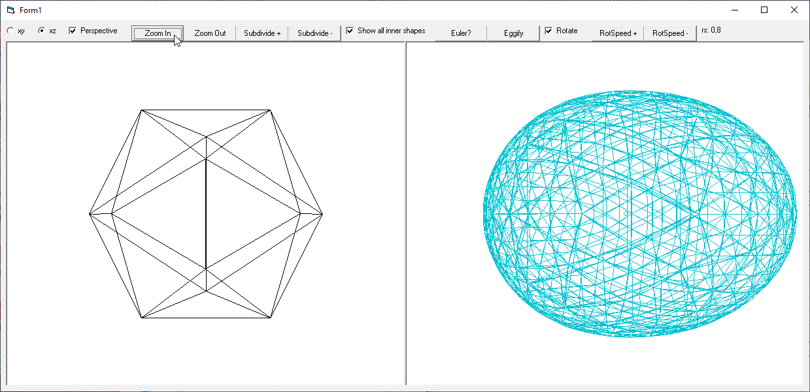

# G3D_IcoSphere
## How to make a sphere by subdividing an Icosahedron  

  
and as an easter-egg how to make an egg out of the sphere.  
3D-objects are animated by 2D and 3D-perspective view, zooming in/out and rotating it.  
Project was started in may 2017.  
  
